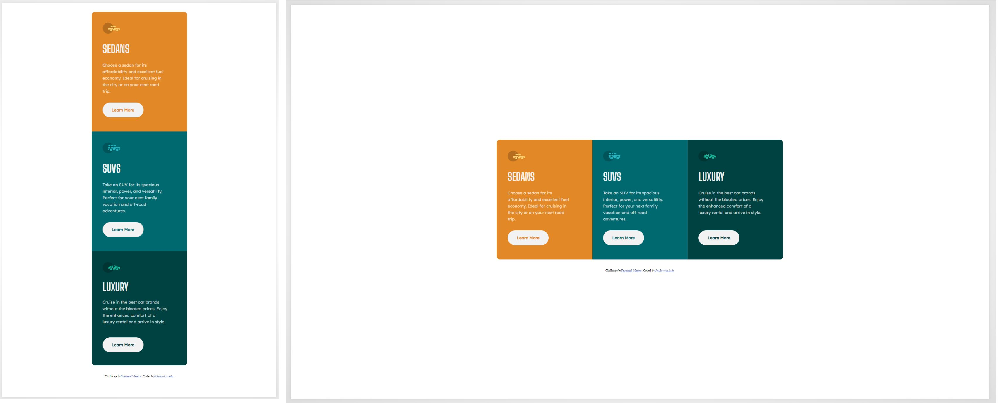

# Frontend Mentor - 3-column preview card component solution

This is a solution to the [3-column preview card component challenge on Frontend Mentor](https://www.frontendmentor.io/challenges/3column-preview-card-component-pH92eAR2-). Frontend Mentor challenges help you improve your coding skills by building realistic projects.

## Table of contents

- [Overview](#overview)
  - [The challenge](#the-challenge)
  - [Screenshot](#screenshot)
  - [Links](#links)
- [My process](#my-process)
  - [Built with](#built-with)
  - [What I learned](#what-i-learned)
  - [Continued development](#continued-development)
  - [Useful resources](#useful-resources)
- [Author](#author)
- [Acknowledgments](#acknowledgments)

**Note: Delete this note and update the table of contents based on what sections you keep.**

## Overview

### The challenge

Users should be able to:

- View the optimal layout depending on their device's screen size
- See hover states for interactive elements

### Screenshot



### Links

- Solution URL: [GitHub](https://github.com/obtulowiczl/FM-3-column-preview-card-component-main)
- Live Site URL: [hosted on Netlify](https://gleaming-churros-36be1e.netlify.app/)

## My process

- first I create three card and color their background, then I center it and make responsive.
- when mobile and desktop view was ready, I started to styling insiding of card

### Built with

- Semantic HTML5 markup
- CSS custom properties
- Flexbox
- CSS Grid
- Mobile-first workflow

### What I learned

- during this challange I practice my grid and flexbox layout.
- using variables in CSS
- learned how to use transparant and inherit property to color button with their background color:

```css
.card button {
  border: 2px solid transparent;
  border-radius: 5rem;
  overflow: hidden;
  border-color: transparent;
  background-color: var(--col-neutral-second);
  font: var(--font-primary);
  color: inherit;
  font-weight: bold;
  width: 150px;
  height: 55px;
  margin: 5px 0;
}

.card button:hover {
  color: white;
  background-color: transparent;
  border-color: white;
  cursor: pointer;
}
```

### Useful resources

- [Grid vs Flexbox by Kevin Powell](https://www.youtube.com/watch?v=3elGSZSWTbM&t=102s) - This guy helped me understand grid and flexbox layouting.
  He has talent to learn others

## Author

- Website - [obtulowicz.info](https://obtulowicz.info)
- Frontend Mentor - [@obtulowiczl](https://www.frontendmentor.io/profile/yourusername)
